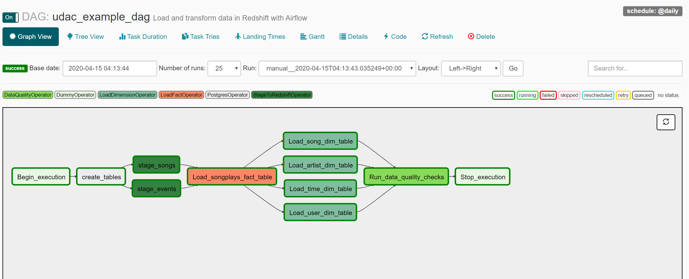

# Airflow_Data_Pipeline
Setting up a Data Pipeline using Airflow, AWS Redshift &amp; S3

## Project Overview
A music streaming company,has decided that it is time to introduce more automation and monitoring to their data warehouse ETL pipelines and come to the conclusion that the best tool to achieve this is Apache Airflow.

Design: Create high grade data pipelines that are dynamic and built from reusable tasks, can be monitored, and allow easy backfills. Data quality plays a big part when analyses are executed on top the data warehouse and want to run tests against their datasets after the ETL steps have been executed to catch any discrepancies in the datasets.
Source data resides in S3 and needs to be processed in Amazon Redshift data warehouse. The source datasets consist of JSON logs that tell about user activity in the application and JSON metadata about the songs the users listen to.

## Technical Details:

```DAG Execution Graph View```



### Scripts in the DAG & Plugin Folder:

#### DAG
udac_example_dag: This script will create the DAG, schedule the dag, import the operators for the tasks.

DAG Schdule: @Daily
   
Tasks: Create Tables, S3 to Redshift staging table load, Fact & Dimension table load & Data Qulaity Check
   
#### PlugIns

Operators:
1. stage_redshift: This script is the operator to load data from S3 JSON formatted files into Redshift staging tables.
This operator creates and runs a SQL COPY statement based on the parameters provided. The operator's parameters should specify where in S3 the file is loaded and what is the target table.

2. load_fact: This script is the operator to load fact data from the staging tables into fact ```songplays``` table.
SQL helper class will be used to run the data transformations queries and inser data into fact table.
```class SqlQueries``` is stored in the helper folder and imported in the main script which will be passed as parameter to the operator script.

3. load_dimension: This script is the operator to load dimension data from the staging tables into dimension tables ```songs``` ```time``` ```artists``` & ```users```
SQL helper class will be used to run the data transformations queries and inser data into fact table.
```class SqlQueries``` is stored in the helper folder and imported in the main script which will be passed as parameter to the operator script.

4. data_quality: This script is the operator to check the quality of data loaded, NULL should not be loaded into the required columns where the analysis will be performed.

Note: sql_queries has been modified to ignore NULL records while loading into fact & dimension tables.
staging_event table was loaded with NULL values for UserId column from S3 Json files, Modified the create table statement for Songplays table to handle this issue. 
Following are the changes:
1. songplays table - created playid as IDENTITY column, removed NOT NULL constarint for userid & removed md5(events.sessionid || events.start_time) songplay_id
2. Added artist_id, song_id & start_time NOT NULL check while loading into Songplays table
3. Added NOT NULL checks for dimension load queries
   

 ```airflow\
    dags\
    logs\
    plugins\
      __init__.py
      helpers\
      operators\
        __init__.py
        data_quality.py
        load_fact.py
        load_dimension.py
        stage_redshift
        


        
